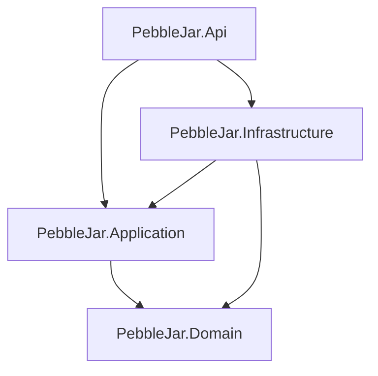

## Week1
 - Use decimal for money as this type is designed for base-10 values (keeps a whole-number value plus decimal scale 12345 with scale 2 -> 123.45) versus binary floating point in float and double (power of 2), that can introduce tiny rounding errors (double total = .1 + .2; // 0.30000000000000004).
 - Use class for Account because it has its own identity and mutable state: i.e. its name and can change while it remains the same account.
 - Class is chosen for transactions despite they are value-like entries whose fields are mostly fixed, because they have an identity and editable description.
	 

## Week2
Project references:

### Scalability evaluation
 - 10 accounts
 - 200 transactions / month
 - 10 years
 => 240_000 transaction * 2 KB = 480_000 KB = 480MB

 SQLite would fit.

## Week3

## Week4

